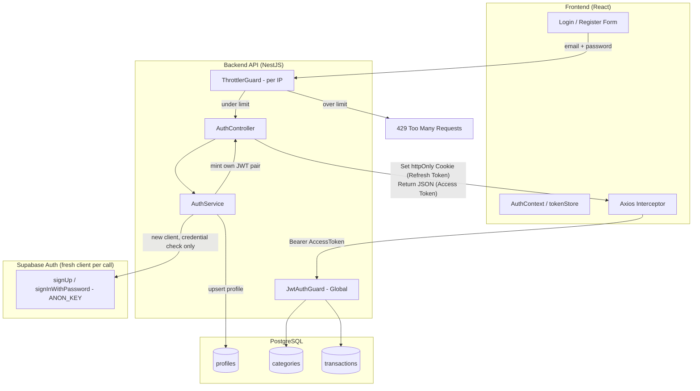
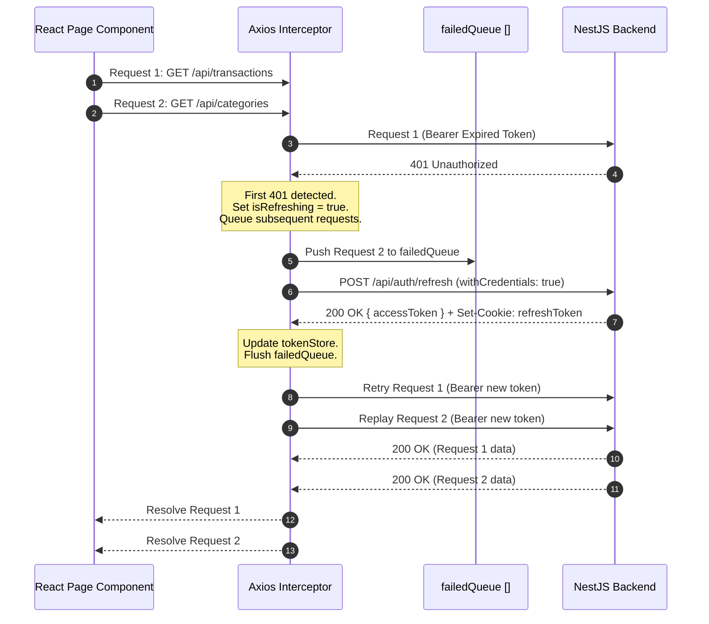

# MySpend — Authentication Architecture Plan

> **Document Purpose**: This document defines the authentication and session-management architecture for MySpend (Personal Expense Tracker). It is adapted from the Azure AD SSO token-exchange pattern used in the `hr-systems` project, replacing Azure AD with Supabase email/password as the identity source, and removing the RBAC/permissions layer since MySpend is a single-tenant, single-role personal application.
>
> **Revision note (v1.1)**: this revision fixes three issues found during review: (1) a Supabase client session-leakage risk on Node.js, (2) missing mandatory rate limiting given the backend-brokered architecture masks client IPs from Supabase, and (3) incorrect key usage (Service Role vs Anon Key) for credential verification.

---

## Table of Contents
1. [Executive Summary](#1-executive-summary)
2. [Design Rationale — What Changed from the HR System Pattern](#2-design-rationale--what-changed-from-the-hr-system-pattern)
3. [Identity Provider: Supabase Auth](#3-identity-provider-supabase-auth)
4. [Token Strategy & Storage Model](#4-token-strategy--storage-model)
5. [Rate Limiting & Abuse Protection (Mandatory)](#5-rate-limiting--abuse-protection-mandatory)
6. [End-to-End Flows](#6-end-to-end-flows)
   - [Flow 1: Registration](#flow-1-registration)
   - [Flow 2: Login](#flow-2-login)
   - [Flow 3: Session Recovery on App Load](#flow-3-session-recovery-on-app-load)
   - [Flow 4: Transparent Token Refresh](#flow-4-transparent-token-refresh)
   - [Flow 5: Logout](#flow-5-logout)
7. [Backend Guard Pipeline](#7-backend-guard-pipeline)
8. [Frontend Protection Layer](#8-frontend-protection-layer)
9. [Data Model: `profiles`](#9-data-model-profiles)
10. [Environment Variables](#10-environment-variables)
11. [Open Questions / Future Considerations](#11-open-questions--future-considerations)

---

## 1. Executive Summary

MySpend uses a **single-provider, backend-brokered, dual-token architecture**:

- **Identity Provider**: Supabase Auth (email/password only — no OAuth/SSO).
- **Credential Handling**: All calls to Supabase Auth happen **server-side**, inside NestJS, using a **freshly created client per call** (see [Section 3](#3-identity-provider-supabase-auth) — this is not optional). The frontend never imports the Supabase client SDK and never sees a Supabase token.
- **Session Tokens**: NestJS mints its **own** JWT pair (Access Token + Refresh Token) after verifying the user's credentials with Supabase — the app's session lifecycle is fully decoupled from Supabase's own token lifetime.
- **Backend**: NestJS + `@nestjs/passport` + `@nestjs/jwt` + `@nestjs/throttler` + TypeORM + PostgreSQL (Supabase-hosted).
- **Frontend**: React + Axios interceptors.
- **No RBAC/PBAC**: every account only ever accesses its own data, so there are no roles or permissions to resolve on each request.



---

## 2. Design Rationale — What Changed from the HR System Pattern

| Aspect | HR System (Azure SSO) | MySpend (adapted) | Why |
|---|---|---|---|
| Identity provider | Azure AD, brokered via Supabase OAuth | Supabase Auth, email/password | MySpend needs self-registration, not enterprise SSO |
| Where Supabase is called from | Frontend (`signInWithOAuth`) — unavoidable, OAuth redirects must happen in-browser | **Backend only** | Password grant has no redirect constraint, so it can be pushed entirely server-side, removing the Supabase SDK from the frontend bundle |
| Supabase client lifecycle | N/A (frontend SDK instance per browser tab/user) | **A new server-side client instance per auth call** | A shared singleton risks session leakage between concurrent users on Node.js (see [Section 3](#3-identity-provider-supabase-auth)) |
| Rate limiting on auth endpoints | Relies on Supabase's own per-IP protection, since Azure/Supabase see the real client IP | **Mandatory `@nestjs/throttler` on the backend**, keyed by real client IP | Supabase only ever sees the NestJS server's IP in this architecture — its own brute-force protection cannot distinguish users and could lock out the whole app |
| `user_type` enum (`azure_sso` / `internal`) | Needed — two credential sources | Removed | Only one identity source exists |
| RBAC / PBAC (`RolesService`, `PermissionsGuard`, `@CheckPermissions`) | Needed — multiple roles (HR, Manager, Employee, Admin) | Removed entirely | Single-user-per-account app; no cross-user permission model |
| Token pair (Access in-memory / Refresh in httpOnly cookie) | Yes | **Kept unchanged** | Provider-agnostic; same XSS/CSRF protection applies regardless of identity source |
| Axios interceptor with request queueing on 401 | Yes | **Kept unchanged** | Fully reusable, no dependency on the identity provider |
| `profiles.id` vs `auth_user_id` split | Needed — supports two provider types per profile | Simplified: `profiles.id` **is** the Supabase user id directly | No second credential source to reconcile against |

---

## 3. Identity Provider: Supabase Auth

Supabase Auth is used purely as a **credential store and verifier** — not as a session provider for the frontend, and not as a source of "current user" state inside the backend process.

### 3.1 Two separate clients, two separate keys

| Client | Key used | Purpose | Lifecycle |
|---|---|---|---|
| **Auth client** | `SUPABASE_ANON_KEY` | `signUp()` / `signInWithPassword()` — credential verification only | **A new instance per call** (see 3.2) |
| **Admin client** | `SUPABASE_SERVICE_ROLE_KEY` | Reserved for privileged operations only (e.g. `auth.admin.deleteUser`, future account-management features) — **not used** in the current register/login path | Can be a long-lived singleton; it never holds a per-user session, so it carries none of the leakage risk described below |

`signInWithPassword` and `signUp` do not require elevated privileges — they are the same calls a browser client would make with a public anon key. Using the Service Role Key for them is an unnecessary privilege escalation and is avoided.

### 3.2 Preventing session leakage on Node.js (mandatory)

`supabase-js`'s internal `GoTrueClient` keeps an in-memory "current session" on the client **instance** itself, separate from whatever the `persistSession` option controls for storage adapters. On a browser, one instance == one user, so this is harmless. On a **shared NestJS singleton**, one instance serves *every* concurrent request — if User A's `signInWithPassword` call and User B's overlap, B's later implicit calls (e.g. `getUser()` with no explicit token) could read A's session state.

**Rule**: the Auth client is never injected as a shared singleton used across requests for credential checks. It is constructed **fresh inside each call**, and only the return value of that call is used — no implicit "current session" is ever read back from the instance afterward.

```ts
// auth.service.ts
private createAuthClient() {
  return createClient(
    this.config.get('SUPABASE_URL'),
    this.config.get('SUPABASE_ANON_KEY'),
    {
      auth: {
        persistSession: false,
        autoRefreshToken: false,
        detectSessionInUrl: false,
      },
    },
  );
}

async login(email: string, password: string) {
  const supabase = this.createAuthClient(); // fresh instance, isolated per call
  const { data, error } = await supabase.auth.signInWithPassword({ email, password });
  if (error) throw new UnauthorizedException('Invalid credentials');

  // Use data.user directly — never call supabase.auth.getUser() afterward
  // expecting it to reflect "the current user"; there is no shared state to trust.
  const profile = await this.profileRepo.upsertFromSupabaseUser(data.user);
  return this.mintTokenPair(profile);
}
```

Creating a client is a cheap, local, synchronous-ish object construction (no network round-trip), so doing it per call has no meaningful performance cost.

---

## 4. Token Strategy & Storage Model

Identical model to the HR system, reused as-is:

| Characteristic | Access Token (JWT) | Refresh Token (JWT) |
|---|---|---|
| Signing Secret | `JWT_SECRET` | `JWT_REFRESH_SECRET` |
| Lifetime | 1 hour | 7 days |
| Storage | In-memory JS variable (`tokenStore.ts`) | `httpOnly`, `Secure`, `SameSite` cookie |
| XSS exposure | None (never in `localStorage`/`sessionStorage`) | None (JS cannot read `httpOnly` cookies) |
| CSRF exposure | None (sent explicitly via `Authorization: Bearer`) | Mitigated via `SameSite=Strict` (dev) / `SameSite=None; Secure` (prod) |
| Payload | `sub` (profile id / Supabase user id), `email` | `sub`, `tokenType: 'refresh'` |
| Used for | Every authenticated API call | Only `POST /api/auth/refresh` |

```ts
const refreshTokenCookieOptions: CookieOptions = {
  httpOnly: true,
  secure: process.env.NODE_ENV === 'production',
  sameSite: process.env.NODE_ENV === 'production' ? 'none' : 'strict',
  maxAge: 7 * 24 * 60 * 60 * 1000, // 7 days
};
```

---

## 5. Rate Limiting & Abuse Protection (Mandatory)

### 5.1 Why this cannot be skipped

In the HR system's Azure flow, Azure AD and Supabase each see the real client making the request. In MySpend's backend-brokered design, **every** login/register attempt reaches Supabase from the same source: the NestJS server's own outbound IP. This has a direct consequence:

- Supabase's built-in brute-force / abuse protection operates per source IP.
- If it ever throttles or blocks that IP because of a malicious user hammering `/api/auth/login`, **every legitimate MySpend user** loses the ability to authenticate — not just the attacker.

Because of this, MySpend's backend must implement its own rate limiting **before** a request is allowed to reach Supabase at all, keyed by the real client IP rather than the server's IP.

### 5.2 Implementation

- Apply `@nestjs/throttler`'s `ThrottlerGuard` directly on `AuthController`, at minimum on `register`, `login`, and `refresh`.
- Example starting limits (adjust based on real usage): 5 requests/minute per IP on `login`, 3 requests/hour per IP on `register`.
- **Trust proxy configuration**: if MySpend is deployed behind a reverse proxy or platform load balancer (Nginx, Render, Railway, etc.), `req.ip` reflects the proxy's IP unless Express is told to trust the proxy's `X-Forwarded-For` header:

```ts
// main.ts
const app = await NestFactory.create(AppModule);
app.getHttpAdapter().getInstance().set('trust proxy', 1);
```

Without this, every request appears to originate from the same internal IP, and the throttler becomes as ineffective as Supabase's own IP-based protection would have been.

- Order of guards matters: `ThrottlerGuard` should run **before** the request reaches `AuthService`, so an attacker's excess requests are rejected with `429` without ever consuming a Supabase Auth API call.

---

## 6. End-to-End Flows

### Flow 1: Registration

```mermaid
sequenceDiagram
    autonumber
    actor User
    participant FE as React Client (RegisterForm)
    participant Throttle as ThrottlerGuard (per IP)
    participant API as NestJS AuthController/AuthService
    participant Supa as Supabase Auth (fresh client, ANON_KEY)
    participant DB as PostgreSQL (profiles)

    User->>FE: Enters email + password
    FE->>Throttle: POST /api/auth/register { email, password }
    alt Rate limit exceeded
        Throttle-->>FE: 429 Too Many Requests
    else Under limit
        Throttle->>API: forward request
        API->>Supa: supabase.auth.signUp({ email, password })
        alt Email already registered / weak password
            Supa-->>API: Error
            API-->>FE: 400 Bad Request
        else Created
            Supa-->>API: Supabase user (id, email)
            API->>DB: Insert profile (id = supabase user id, email)
            DB-->>API: Profile
            Note over API: Mint Access Token (1h) & Refresh Token (7d)
            API-->>FE: 201 Created<br/>Set-Cookie: refreshToken=<JWT>; HttpOnly<br/>Body: { accessToken, user }
            FE->>FE: tokenStore.setAccessToken(accessToken)
            FE->>API: GET /api/auth/me (Bearer accessToken)
            API-->>FE: Profile
            FE->>FE: Set AuthContext, navigate to Dashboard
        end
    end
```

**Note**: MySpend registers and logs the user in within the same request — there is no separate email-confirmation gate in v1, since this is a single-user personal tool. This can be revisited later (see [Section 11](#11-open-questions--future-considerations)).

### Flow 2: Login

```mermaid
sequenceDiagram
    autonumber
    actor User
    participant FE as React Client (LoginForm)
    participant Throttle as ThrottlerGuard (per IP)
    participant API as NestJS AuthController/AuthService
    participant Supa as Supabase Auth (fresh client, ANON_KEY)
    participant DB as PostgreSQL (profiles)

    User->>FE: Enters email + password
    FE->>Throttle: POST /api/auth/login { email, password }
    alt Rate limit exceeded
        Throttle-->>FE: 429 Too Many Requests
    else Under limit
        Throttle->>API: forward request
        API->>Supa: supabase.auth.signInWithPassword({ email, password })
        alt Invalid credentials
            Supa-->>API: Error
            API-->>FE: 401 Unauthorized
        else Valid
            Supa-->>API: Supabase session (user)
            API->>DB: Upsert profile (id, email)
            DB-->>API: Profile
            Note over API: Mint Access Token (1h) & Refresh Token (7d)
            API-->>FE: 200 OK<br/>Set-Cookie: refreshToken=<JWT>; HttpOnly<br/>Body: { accessToken, user }
            FE->>FE: tokenStore.setAccessToken(accessToken)
            FE->>API: GET /api/auth/me (Bearer accessToken)
            API-->>FE: Profile
            FE->>FE: Set AuthContext, navigate to Dashboard
        end
    end
```

### Flow 3: Session Recovery on App Load

Identical in shape to the HR system's Flow 3. The in-memory access token is lost on every full page reload, so the app silently restores the session using the refresh cookie:

```mermaid
sequenceDiagram
    autonumber
    participant App as React App (AuthProvider init)
    participant API as NestJS (POST /auth/refresh)
    participant DB as PostgreSQL (profiles)

    App->>API: POST /api/auth/refresh (Cookie: refreshToken=<JWT>)
    alt No refreshToken cookie
        API-->>App: 401 Unauthorized
        App->>App: user = null, loading = false (stay on Login page)
    else Cookie present
        Note over API: Verify Refresh Token with JWT_REFRESH_SECRET<br/>Verify tokenType === 'refresh'
        API->>DB: Fetch profile by id (payload.sub)
        DB-->>API: Profile
        Note over API: Issue new Access Token (1h) & new Refresh Token (7d)
        API-->>App: 200 OK<br/>Set-Cookie: refreshToken=<NEW_JWT>; HttpOnly<br/>Body: { accessToken, user }
        App->>App: tokenStore.setAccessToken(accessToken)
        App->>API: GET /api/auth/me (Bearer accessToken)
        API-->>App: Profile
        App->>App: setUser(profile), loading = false (Authenticated)
    end
```

### Flow 4: Transparent Token Refresh

Reused verbatim from the HR system — this logic is provider-agnostic and requires no changes:



### Flow 5: Logout

```mermaid
sequenceDiagram
    autonumber
    actor User
    participant App as React Client (AuthContext)
    participant API as NestJS Backend

    User->>App: Click "Logout"
    App->>API: POST /api/auth/logout (Bearer accessToken)
    API-->>App: 200 OK<br/>Set-Cookie: refreshToken=; Max-Age=0 (cleared)
    App->>App: tokenStore.clear()<br/>setUser(null)
    App->>User: Redirect to /login
```

No Supabase-side sign-out call is required, since the frontend never held a Supabase session to begin with — the backend's own refresh cookie is the only session artifact that needs clearing.

---

## 7. Backend Guard Pipeline

Simplified compared to the HR system — no permission resolution step. Note that `ThrottlerGuard` (Section 5) sits in front of this pipeline specifically on the auth routes; it is not part of the global per-request guard chain shown here.

```mermaid
flowchart TD
    Req[Incoming HTTP Request] --> CheckPub{Is Endpoint Marked @Public?}
    CheckPub -- Yes --> Handler[Execute Controller Handler]
    CheckPub -- No --> JwtCheck[JwtAuthGuard: verify Access Token]
    JwtCheck -- Invalid/Expired --> Ex401[Throw 401 Unauthorized]
    JwtCheck -- Valid --> AttachUser[Attach req.user = { userId, email }]
    AttachUser --> Handler
```

```ts
// jwt-auth.guard.ts
@Injectable()
export class JwtAuthGuard extends AuthGuard('jwt') {}

// jwt.strategy.ts
@Injectable()
export class JwtStrategy extends PassportStrategy(Strategy) {
  constructor(config: ConfigService) {
    super({
      jwtFromRequest: ExtractJwt.fromAuthHeaderAsBearerToken(),
      ignoreExpiration: false,
      secretOrKey: config.get('JWT_SECRET'),
    });
  }

  async validate(payload: { sub: string; email: string }) {
    return { userId: payload.sub, email: payload.email };
  }
}
```

Every service method that touches `categories` or `transactions` must filter by `userId` taken from `req.user` — this is the single enforcement point for data isolation (equivalent to `FR-AUTH-003` in the PRD).

---

## 8. Frontend Protection Layer

- **`AuthContext`**: holds `user`, `loading`, `isAuthenticated`. No `permissions` array is needed (unlike the HR system's flattened permission list).
- **`<ProtectedRoute>`**: the only route guard needed — checks `isAuthenticated`, redirects to `/login` if false. `<PermissionProtectedRoute>` and `<RoleProtectedRoute>` from the HR pattern are **not** applicable and are omitted.
- **`tokenStore.ts`**: same in-memory pattern as the HR system — a plain module-level variable, never `localStorage`.
- **Axios interceptor**: identical to the HR system's Flow 4 implementation; can likely be copied with only the base URL changed.

---

## 9. Data Model: `profiles`

```sql
CREATE TABLE profiles (
  id         uuid PRIMARY KEY,      -- same as Supabase auth.users.id
  email      text UNIQUE NOT NULL,
  created_at timestamptz NOT NULL DEFAULT now(),
  updated_at timestamptz NOT NULL DEFAULT now()
);
```

Unlike the HR system's `profiles` table, MySpend does **not** need:
- `user_type` (`azure_sso` | `internal`) — single provider.
- `hash_password` — Supabase owns password storage entirely.
- `azure_oid`, `tenant_id` — no OAuth provider involved.
- `manager_id`, `team_id` — no organizational hierarchy.

`categories.user_id` and `transactions.user_id` reference `profiles.id` directly.

---

## 10. Environment Variables

| Variable | Used by | Purpose |
|---|---|---|
| `SUPABASE_URL` | Backend only | Supabase project endpoint |
| `SUPABASE_ANON_KEY` | Backend only | Used to construct a **fresh** Auth client per call for `signUp` / `signInWithPassword` — this is the credential-verification path, and needs no elevated privilege |
| `SUPABASE_SERVICE_ROLE_KEY` | Backend only | Reserved for privileged Admin API operations only (not used in the current register/login path) — **never used for `signInWithPassword`/`signUp`, and never exposed to the frontend** |
| `JWT_SECRET` | Backend only | Signs/verifies MySpend's own Access Tokens |
| `JWT_REFRESH_SECRET` | Backend only | Signs/verifies MySpend's own Refresh Tokens |
| `JWT_EXPIRES_IN` | Backend only | Access token TTL (default `1h`) |
| `JWT_REFRESH_EXPIRES_IN` | Backend only | Refresh token TTL (default `7d`) |

Note that, unlike the earlier "frontend calls Supabase directly" design, MySpend's frontend needs **no Supabase-related environment variables at all** — it only ever talks to the NestJS API.

---

## 11. Open Questions / Future Considerations

- **Email confirmation**: currently skipped for simplicity (single personal user). If MySpend is ever shared with other real users, enabling Supabase's email confirmation step before allowing login should be revisited.
- **Password reset**: out of scope for v1.1 of the PRD; when added, it can reuse the same backend-brokered pattern — NestJS calls Supabase's password-reset APIs server-side rather than exposing them to the frontend.
- **Refresh token rotation/blacklisting**: the HR system does not implement server-side refresh token revocation on logout beyond clearing the cookie; the same trade-off is acceptable here given the low-risk, single-user context.
- **Per-account (not just per-IP) throttling on login**: Section 5 covers per-IP limits, which stop single-source brute force. A distributed attempt spread across many IPs against one email is not covered; a simple failed-attempt counter per account could be added later if this app is ever exposed beyond personal use.
