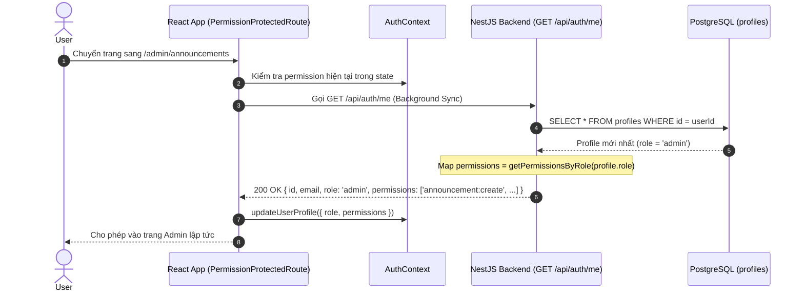
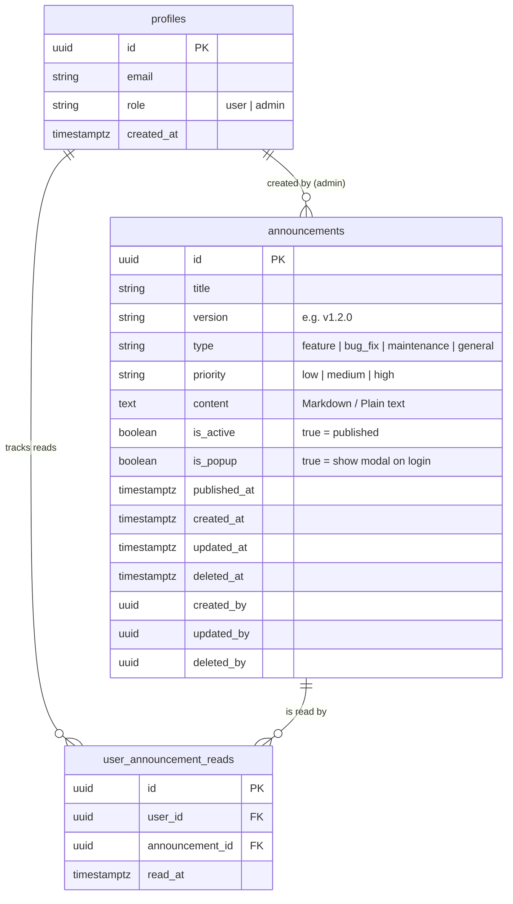
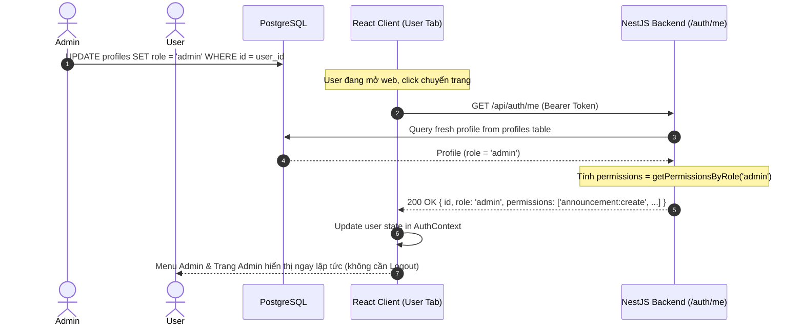
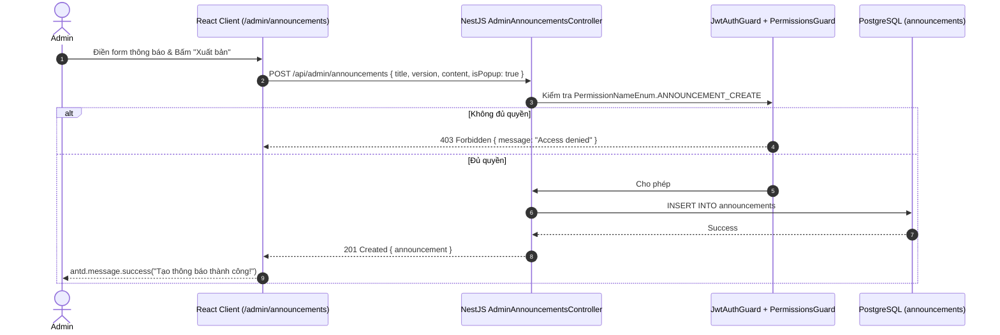
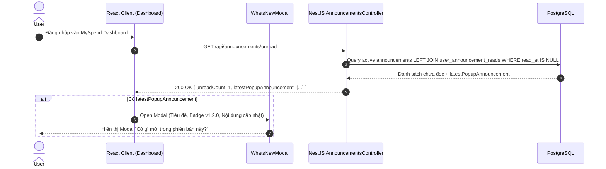
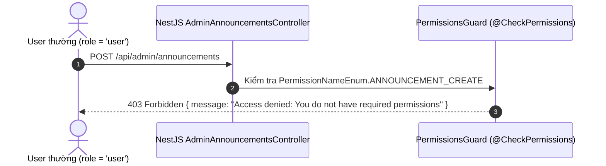

# MySpend — Announcement Feature & Permission-based RBAC Authorization Plan (Phase 3)

> **Document Purpose**: Kế hoạch chi tiết kiến trúc và triển khai tính năng **Thông báo cập nhật phiên bản / New Deploy Announcement (What's New)** và hệ thống **Phân quyền Role-based Permission Access Control (Lightweight PBAC: Role ở DB + Permission Mapping tĩnh + Cơ chế Real-time Permission Sync qua `/auth/me`)** cho ứng dụng MySpend theo đúng chuẩn quy ước tại `AGENTS.md` (kế thừa pattern từ `hr_system`).
> **Base Architecture**: Monorepo Nx 21 | NestJS 11 | React 19 + Vite 7 | PostgreSQL + TypeORM 0.3.x | Ant Design v5 | `@myspend/libs`.
> **Status**: 📝 Architecture & Implementation Plan — Đã tích hợp cơ chế đồng bộ Permission tức thì khi chuyển trang (`/auth/me`).

---

## Mục lục (Table of Contents)
1. [Tổng quan & Mục tiêu nghiệp vụ (Executive Summary)](#1-tổng-quan--mục-tiêu-nghiệp-vụ-executive-summary)
2. [Kiến trúc phân quyền: Lightweight RBAC & Cơ chế đồng bộ Real-time](#2-kiến-trúc-phân-quyền-lightweight-rbac--cơ-chế-đồng-bộ-real-time)
   - [2.1 Tại sao chọn Lightweight PBAC?](#21-tại-sao-chọn-lightweight-pbac)
   - [2.2 Vấn đề Stale Permission & Giải pháp đồng bộ qua `GET /auth/me` (Pattern từ `hr_system`)](#22-vấn-đề-stale-permission--giải-pháp-đồng-bộ-qua-get-authme-pattern-từ-hr_system)
   - [2.3 Mở rộng Data Model `profiles`](#23-mở-rộng-data-model-profiles)
   - [2.4 Permission & Role Mapping trong `@myspend/libs`](#24-permission--role-mapping-trong-myspendlibs)
   - [2.5 Backend Guard Pipeline: `JwtAuthGuard` + `PermissionsGuard`](#25-backend-guard-pipeline-jwtauthguard--permissionsguard)
   - [2.6 Backend `AuthService.getMe()` & `createSession()`](#26-backend-authservicegetme--createsession)
   - [2.7 Frontend: `<PermissionProtectedRoute>` & Auto-sync Permission khi chuyển trang](#27-frontend-permissionprotectedroute--auto-sync-permission-khi-chuyển-trang)
   - [2.8 Chiến lược Bootstrap Admin](#28-chiến-lược-bootstrap-admin)
3. [Mô hình dữ liệu Announcement (Database Schema & Entities)](#3-mô-hình-dữ-liệu-announcement-database-schema--entities)
   - [3.1 Bảng `announcements`](#31-bảng-announcements)
   - [3.2 Bảng `user_announcement_reads`](#32-bảng-user_announcement_reads)
   - [3.3 Migration SQL Script](#33-migration-sql-script)
4. [Shared Library (`@myspend/libs`)](#4-shared-library-myspendlibs)
   - [4.1 Enums (`libs/src/lib/enums/`)](#41-enums-libssrclibenums)
   - [4.2 Consts (`libs/src/lib/consts/`)](#42-consts-libssrclibconsts)
   - [4.3 Types & Interfaces (`libs/src/lib/types/`)](#43-types--interfaces-libssrclibtypes)
5. [Thiết kế Backend (`apps/service`)](#5-thiết-kế-backend-appsservice)
   - [5.1 Cấu trúc thư mục Module](#51-cấu-trúc-thư-mục-module)
   - [5.2 Business Rules & Logic Nghiệp vụ](#52-business-rules--logic-nghiệp-vụ)
   - [5.3 DTOs & Validation](#53-dtos--validation)
   - [5.4 Repository Pattern](#54-repository-pattern)
   - [5.5 Controllers & Endpoints](#55-controllers--endpoints)
6. [Thiết kế Frontend (`apps/client`)](#6-thiết-kế-frontend-appsclient)
   - [6.1 Trải nghiệm người dùng thông thường (User Experience)](#61-trải-nghiệm-người-dùng-thông-thường-user-experience)
   - [6.2 Trải nghiệm quản trị viên (Admin Management Portal)](#62-trải-nghiệm-quản-trị-viên-admin-management-portal)
   - [6.3 Cấu trúc Components & Hooks](#63-cấu-trúc-components--hooks)
7. [Luồng hoạt động End-to-End (Flow Diagrams)](#7-luồng-hoạt-động-end-to-end-flow-diagrams)
   - [Flow 1: Real-time Permission Sync khi user chuyển trang](#flow-1-real-time-permission-sync-khi-user-chuyển-trang)
   - [Flow 2: Admin tạo & xuất bản thông báo](#flow-2-admin-tạo--xuất-bản-thông-báo)
   - [Flow 3: User nhận Popup What's New sau deploy](#flow-3-user-nhận-popup-whats-new-sau-deploy)
   - [Flow 4: Chặn truy cập trái phép bằng PermissionsGuard](#flow-4-chặn-truy-cập-trái-phép-bằng-permissionsguard)
8. [Tài liệu đặc tả API (API Reference)](#8-tài-liệu-đặc-tả-api-api-reference)
9. [Kế hoạch triển khai từng bước (Step-by-Step Phasing)](#9-kế-hoạch-triển-khai-từng-bước-step-by-step-phasing)

---

## 1. Tổng quan & Mục tiêu nghiệp vụ (Executive Summary)

### Bối cảnh & Yêu cầu:
- MySpend đã go-live với dữ liệu thực tế của người dùng.
- Cần bổ sung phân quyền quản trị (Admin) để cấu hình các thông báo cập nhật phiên bản (New Deploy / Release Announcement / What's New).
- **Yêu cầu quan trọng từ `hr_system`**: Khi quyền (Role / Permissions) của người dùng được cập nhật trên database, người dùng **không cần phải đăng xuất rồi đăng nhập lại** để nhận quyền mới. Hệ thống cần tự động đồng bộ tức thì quyền mới nhất thông qua API `GET /api/auth/me` khi chuyển trang (Navigation).

---

## 2. Kiến trúc phân quyền: Lightweight RBAC & Cơ chế đồng bộ Real-time

### 2.1 Tại sao chọn Lightweight PBAC?
- **Role lưu tại DB (`profiles.role`)**: Đơn giản, chỉ 1 cột trong bảng `profiles`.
- **Permission Map tĩnh tại Shared Library (`@myspend/libs`)**: Định nghĩa `PermissionNameEnum` và map `Role -> PermissionNameEnum[]` trong code.
- **Lợi ích**:
  - Không tốn thêm bất kỳ câu JOIN database nào khi xác thực.
  - 100% chuẩn phân quyền chuyên nghiệp: Controller chỉ kiểm tra `@CheckPermissions(PermissionNameEnum.ANNOUNCEMENT_CREATE)`.

### 2.2 Vấn đề Stale Permission & Giải pháp đồng bộ qua `GET /auth/me` (Pattern từ `hr_system`)

#### 🔴 Vấn đề nếu chỉ lưu quyền trong JWT Access Token (Stale Token Claims):
Nếu Access Token có thời hạn 1 giờ (`expiresIn: '1h'`) và nhúng cứng permissions vào token payload, khi Admin nâng quyền cho 1 User trong DB, User đó phải đợi 1 tiếng hoặc phải Logout thì mới có quyền mới.

#### 🟢 Giải pháp: Đồng bộ liên tục qua `GET /api/auth/me`
1. **Backend**:
   - `GET /api/auth/me` truy vấn trực tiếp bản ghi `profiles` mới nhất từ Database theo `userId`.
   - Resolve danh sách permissions mới nhất qua `getPermissionsByRole(profile.role)`.
   - Trả về Profile kèm `permissions` mới nhất cho Client.
   - Ở `PermissionsGuard` backend: Kiểm tra permission dựa trên profile hiện tại (hoặc luôn resolve permissions tươi từ role).
2. **Frontend**:
   - Hook `useAuth` cung cấp hàm `fetchMe()`.
   - Trong component `<PermissionProtectedRoute>` hoặc lắng nghe `location.pathname` (mỗi khi chuyển trang), gọi `fetchMe()` ngầm (background sync).
   - Nếu quyền vừa được cấp -> UI mở ngay menu/trang Admin.
   - Nếu quyền vừa bị thu hồi -> Redirect ngay về Home mà không gặp lỗi stale session.



### 2.3 Mở rộng Data Model `profiles`
Bổ sung cột `role` vào bảng `profiles`:

```sql
-- Create ENUM type
DO $$ 
BEGIN
  IF NOT EXISTS (SELECT 1 FROM pg_type WHERE typname = 'user_role_enum') THEN
    CREATE TYPE "user_role_enum" AS ENUM ('admin', 'user');
  END IF;
END $$;

-- Migration: Add role column to profiles
ALTER TABLE "profiles" 
ADD COLUMN "role" "user_role_enum" NOT NULL DEFAULT 'user';

CREATE INDEX "IDX_profiles_role" ON "profiles" ("role");
```

### 2.4 Permission & Role Mapping trong `@myspend/libs`

```ts
// libs/src/lib/enums/permission-name.enum.ts
export enum PermissionNameEnum {
  // Announcements
  ANNOUNCEMENT_READ   = 'announcement:read',
  ANNOUNCEMENT_CREATE = 'announcement:create',
  ANNOUNCEMENT_UPDATE = 'announcement:update',
  ANNOUNCEMENT_DELETE = 'announcement:delete',
}

// libs/src/lib/enums/user-role.enum.ts
export enum UserRoleEnum {
  ADMIN = 'admin',
  USER  = 'user',
}

// libs/src/lib/consts/permissions.const.ts
export const ROLE_PERMISSIONS_MAP: Record<UserRoleEnum, PermissionNameEnum[]> = {
  [UserRoleEnum.ADMIN]: [
    PermissionNameEnum.ANNOUNCEMENT_READ,
    PermissionNameEnum.ANNOUNCEMENT_CREATE,
    PermissionNameEnum.ANNOUNCEMENT_UPDATE,
    PermissionNameEnum.ANNOUNCEMENT_DELETE,
  ],
  [UserRoleEnum.USER]: [
    PermissionNameEnum.ANNOUNCEMENT_READ,
  ],
};

export const getPermissionsByRole = (role: UserRoleEnum): PermissionNameEnum[] => {
  return ROLE_PERMISSIONS_MAP[role] || [PermissionNameEnum.ANNOUNCEMENT_READ];
};
```

### 2.5 Backend Guard Pipeline: `JwtAuthGuard` + `PermissionsGuard`

- Decorator `@CheckPermissions`:
```ts
// apps/service/src/auth/decorators/check-permissions.decorator.ts
import { SetMetadata } from '@nestjs/common';
import { PermissionNameEnum } from '@myspend/libs';

export const PERMISSIONS_KEY = 'permissions';
export const CheckPermissions = (...permissions: PermissionNameEnum[]) =>
  SetMetadata(PERMISSIONS_KEY, permissions);
```

- Guard `PermissionsGuard`:
```ts
// apps/service/src/auth/guards/permissions.guard.ts
@Injectable()
export class PermissionsGuard implements CanActivate {
  constructor(
    private reflector: Reflector,
    private profilesRepository: ProfilesRepository,
  ) {}

  async canActivate(context: ExecutionContext): Promise<boolean> {
    const requiredPermissions = this.reflector.getAllAndOverride<PermissionNameEnum[]>(
      PERMISSIONS_KEY,
      [context.getHandler(), context.getClass()]
    );

    if (!requiredPermissions || requiredPermissions.length === 0) {
      return true;
    }

    const { user } = context.switchToHttp().getRequest();
    if (!user || !user.userId) {
      throw new ForbiddenException('Access denied: Unauthorized session');
    }

    // Luôn query profile mới nhất từ DB để đảm bảo không bị stale permission
    const currentProfile = await this.profilesRepository.findById(user.userId);
    if (!currentProfile) {
      throw new ForbiddenException('Access denied: User profile not found');
    }

    const currentPermissions = getPermissionsByRole(currentProfile.role || UserRoleEnum.USER);
    const hasPermission = requiredPermissions.every((perm) =>
      currentPermissions.includes(perm)
    );

    if (!hasPermission) {
      throw new ForbiddenException('Access denied: You do not have required permissions');
    }

    // Gắn permissions tươi vào request object
    user.role = currentProfile.role;
    user.permissions = currentPermissions;

    return true;
  }
}
```

### 2.6 Backend `AuthService.getMe()` & `createSession()`

```ts
// apps/service/src/auth/auth.service.ts
async getMe(userId: string) {
  const profile = await this.profilesRepository.findById(userId);

  if (!profile) {
    throw new UnauthorizedException('Profile not found');
  }

  const permissions = getPermissionsByRole(profile.role || UserRoleEnum.USER);

  return {
    ...profile,
    permissions,
  };
}

private async createSession(profile: ProfileEntity) {
  const role = profile.role || UserRoleEnum.USER;
  const permissions = getPermissionsByRole(role);

  const [accessToken, refreshToken] = await Promise.all([
    this.jwtService.signAsync(
      { sub: profile.id, email: profile.email, role, permissions },
      {
        secret: this.config.get<string>('jwt.secret'),
        expiresIn: this.getJwtExpiresIn('jwt.expiresIn'),
      }
    ),
    this.jwtService.signAsync(
      { sub: profile.id, tokenType: 'refresh' },
      {
        secret: this.config.get<string>('jwt.refreshSecret'),
        expiresIn: this.getJwtExpiresIn('jwt.refreshExpiresIn'),
      }
    ),
  ]);

  return {
    accessToken,
    refreshToken,
    user: {
      ...profile,
      permissions,
    },
  };
}
```

### 2.7 Frontend: `<PermissionProtectedRoute>` & Auto-sync Permission khi chuyển trang

1. **`AuthContext.tsx`**:
```tsx
export interface IAuthUser extends IProfile {
  permissions: PermissionNameEnum[];
}

// Cung cấp hàm fetchMe để cập nhật user & permissions bất cứ lúc nào
const fetchMe = useCallback(async () => {
  try {
    const { data } = await apiClient.get<IAuthUser>('/auth/me');
    setUser(data);
    return data;
  } catch (error) {
    // Không làm gián đoạn UI nếu network trục trặc tạm thời
    return null;
  }
}, []);

const hasPermission = useCallback(
  (permission: PermissionNameEnum) => {
    return user?.permissions?.includes(permission) ?? false;
  },
  [user]
);
```

2. **`<PermissionProtectedRoute>`**:
```tsx
export const PermissionProtectedRoute: React.FC<{
  permission: PermissionNameEnum;
  children?: React.ReactNode;
}> = ({ permission, children }) => {
  const { user, loading, isAuthenticated, fetchMe } = useAuth();
  const location = useLocation();

  // Tự động fetchMe ngầm mỗi khi chuyển vào route được bảo vệ
  useEffect(() => {
    if (isAuthenticated) {
      fetchMe();
    }
  }, [location.pathname, isAuthenticated, fetchMe]);

  if (loading) return <LoadingSpinner />;
  if (!isAuthenticated) return <Navigate to={AppRoutes.LOGIN} replace />;

  if (!user?.permissions?.includes(permission)) {
    return <Navigate to={AppRoutes.HOME} replace />;
  }

  return children ? <>{children}</> : <Outlet />;
};
```

### 2.8 Chiến lược Bootstrap Admin
```sql
UPDATE "profiles" 
SET "role" = 'admin' 
WHERE "email" = 'duyanh101103@gmail.com'; -- Email quản trị viên
```

---

## 3. Mô hình dữ liệu Announcement (Database Schema & Entities)



### 3.1 Bảng `announcements`
```sql
CREATE TABLE "announcements" (
  "id"            uuid                         NOT NULL DEFAULT gen_random_uuid(),
  "title"         varchar(255)                 NOT NULL,
  "version"       varchar(50),
  "type"          "announcement_type_enum"     NOT NULL DEFAULT 'feature',
  "priority"      "announcement_priority_enum" NOT NULL DEFAULT 'medium',
  "content"       text                         NOT NULL,
  "is_active"     boolean                      NOT NULL DEFAULT true,
  "is_popup"      boolean                      NOT NULL DEFAULT true,
  "published_at"  TIMESTAMPTZ                  NOT NULL DEFAULT now(),
  "created_at"    TIMESTAMPTZ                  NOT NULL DEFAULT now(),
  "updated_at"    TIMESTAMPTZ                  NOT NULL DEFAULT now(),
  "deleted_at"    TIMESTAMPTZ,
  "created_by"    uuid                         REFERENCES "profiles"("id"),
  "updated_by"    uuid                         REFERENCES "profiles"("id"),
  "deleted_by"    uuid                         REFERENCES "profiles"("id"),
  CONSTRAINT "PK_announcements_id" PRIMARY KEY ("id")
);

CREATE INDEX "IDX_announcements_active_published" 
  ON "announcements" ("is_active", "published_at" DESC) 
  WHERE "deleted_at" IS NULL;
```

### 3.2 Bảng `user_announcement_reads`
```sql
CREATE TABLE "user_announcement_reads" (
  "id"               uuid        NOT NULL DEFAULT gen_random_uuid(),
  "user_id"          uuid        NOT NULL REFERENCES "profiles"("id") ON DELETE CASCADE,
  "announcement_id"  uuid        NOT NULL REFERENCES "announcements"("id") ON DELETE CASCADE,
  "read_at"          TIMESTAMPTZ NOT NULL DEFAULT now(),
  CONSTRAINT "PK_user_announcement_reads_id" PRIMARY KEY ("id"),
  CONSTRAINT "UQ_user_announcement_reads" UNIQUE ("user_id", "announcement_id")
);

CREATE INDEX "IDX_user_announcement_reads_user" 
  ON "user_announcement_reads" ("user_id");
```

---

## 4. Shared Library (`@myspend/libs`)

### 4.1 Enums (`libs/src/lib/enums/`)
1. `permission-name.enum.ts`: `PermissionNameEnum` (`ANNOUNCEMENT_READ`, `ANNOUNCEMENT_CREATE`, `ANNOUNCEMENT_UPDATE`, `ANNOUNCEMENT_DELETE`).
2. `user-role.enum.ts`: `UserRoleEnum` (`ADMIN = 'admin'`, `USER = 'user'`).
3. `announcement-type.enum.ts`: `AnnouncementTypeEnum` (`FEATURE = 'feature'`, `BUG_FIX = 'bug_fix'`, `MAINTENANCE = 'maintenance'`, `GENERAL = 'general'`).
4. `announcement-priority.enum.ts`: `AnnouncementPriorityEnum` (`LOW = 'low'`, `MEDIUM = 'medium'`, `HIGH = 'high'`).
5. `api-routes.enum.ts`: Bổ sung `ANNOUNCEMENTS = 'announcements'`, `ADMIN_ANNOUNCEMENTS = 'admin/announcements'`.

### 4.2 Consts (`libs/src/lib/consts/`)
1. `permissions.const.ts`: `ROLE_PERMISSIONS_MAP`, `getPermissionsByRole`.

### 4.3 Types & Interfaces (`libs/src/lib/types/`)
1. `profile.types.ts`: Cập nhật `IProfile` thêm `role: UserRoleEnum` và `permissions?: PermissionNameEnum[]`.
2. `announcement.types.ts`: `IAnnouncement`, `IUserAnnouncementRead`, `ICreateAnnouncementDto`, `IUpdateAnnouncementDto`, `IAnnouncementUnreadResponse`.

---

## 5. Thiết kế Backend (`apps/service`)

### 5.1 Cấu trúc thư mục Module
```
apps/service/src/
├── auth/
│   ├── decorators/
│   │   ├── public.decorator.ts
│   │   └── check-permissions.decorator.ts  <-- Decorator @CheckPermissions
│   └── guards/
│       ├── jwt-auth.guard.ts
│       └── permissions.guard.ts           <-- Guard kiểm tra quyền & đồng bộ DB
├── announcements/
│   ├── announcements.module.ts
│   ├── announcements.controller.ts        <-- User APIs (đọc thông báo)
│   ├── admin-announcements.controller.ts  <-- Admin CRUD APIs (@CheckPermissions)
│   ├── announcements.service.ts
│   ├── dto/
│   │   ├── create-announcement.dto.ts
│   │   ├── update-announcement.dto.ts
│   │   └── query-announcement.dto.ts
│   └── repository/
│       ├── announcements.repository.ts
│       └── user-announcement-reads.repository.ts
└── entities/
    └── announcement/
        ├── announcement.entity.ts
        └── user-announcement-read.entity.ts
```

### 5.2 Business Rules & Logic Nghiệp vụ
- **BR-ANN-001 (Quyền cấu hình)**: Mọi thao tác Create / Update / Delete / Toggle status của Announcement yêu cầu `PermissionNameEnum.ANNOUNCEMENT_CREATE / UPDATE / DELETE`.
- **BR-ANN-002 (Lọc thông báo User)**: Endpoint User chỉ trả về các thông báo có `isActive === true`, `publishedAt <= now()` và chưa bị soft-delete (`deletedAt IS NULL`).
- **BR-ANN-003 (Popup tự động)**: Khi user gọi `GET /api/announcements/unread`, backend tìm thông báo active mới nhất có `isPopup === true` mà user chưa có bản ghi trong bảng `user_announcement_reads`.
- **BR-ANN-004 (Đánh dấu đã đọc)**: Khi user đóng modal hoặc bấm "Đã hiểu", frontend gọi `POST /api/announcements/:id/read`. Backend upsert vào `user_announcement_reads`.
- **BR-ANN-005 (Đánh dấu tất cả đã đọc)**: `POST /api/announcements/read-all` đánh dấu toàn bộ thông báo active hiện tại là đã đọc.

---

## 6. Thiết kế Frontend (`apps/client`)

### 6.1 Trải nghiệm người dùng thông thường (User Experience)
1. **What's New Modal (`<WhatsNewModal />`)**:
   - Khi load App / Dashboard, fetch `GET /api/announcements/unread`.
   - Nếu có `latestPopupAnnouncement`, tự động hiển thị Modal kèm icon pháo hoa/chuông, badge phiên bản, nội dung Markdown các tính năng mới và nút "Đã hiểu / Got it".
2. **Notification Bell trên Header (`<AnnouncementBell />`)**:
   - Icon chuông có badge số lượng thông báo chưa đọc. Click mở Popover / Drawer xem lịch sử các bản cập nhật.

### 6.2 Trải nghiệm quản trị viên (Admin Management Portal)
1. **Header Dropdown**: Chỉ hiển thị mục **"⚙️ Quản lý thông báo"** nếu `hasPermission(PermissionNameEnum.ANNOUNCEMENT_CREATE)`.
2. **Trang `/admin/announcements`**:
   - Bảng danh sách Ant Design Table: Tiêu đề, Phiên bản, Phân loại, Ưu tiên, Bật/tắt (`Switch`), Hiện Popup, Ngày xuất bản, Thao tác (Sửa, Xóa).
   - Dialog Modal: Form Ant Design v5 tạo/sửa thông báo với hỗ trợ Markdown.

---

## 7. Luồng hoạt động End-to-End (Flow Diagrams)

### Flow 1: Real-time Permission Sync khi user chuyển trang



### Flow 2: Admin tạo & xuất bản thông báo



### Flow 3: User nhận Popup What's New sau deploy



### Flow 4: Chặn truy cập trái phép bằng PermissionsGuard



---

## 8. Tài liệu đặc tả API (API Reference)

### 8.1 User Endpoints (Yêu cầu đăng nhập)
| Phương thức | Endpoint | Permission | Mô tả |
|---|---|---|---|
| `GET` | `/api/auth/me` | - | Lấy profile tươi từ DB + danh sách `permissions` hiện tại (Dùng để sync real-time). |
| `GET` | `/api/announcements` | - | Lấy danh sách thông báo đã phát hành (kèm cờ `isRead`). |
| `GET` | `/api/announcements/unread` | - | Lấy số lượng thông báo chưa đọc và thông báo popup mới nhất. |
| `POST` | `/api/announcements/:id/read` | - | Đánh dấu 1 thông báo cụ thể là đã đọc. |
| `POST` | `/api/announcements/read-all` | - | Đánh dấu tất cả thông báo hiện có là đã đọc. |

### 8.2 Admin Endpoints (Yêu cầu PermissionsGuard)
| Phương thức | Endpoint | Permission Required | Mô tả |
|---|---|---|---|
| `GET` | `/api/admin/announcements` | `announcement:read` | Lấy danh sách tất cả thông báo phục vụ quản trị. |
| `GET` | `/api/admin/announcements/:id` | `announcement:read` | Xem chi tiết 1 thông báo. |
| `POST` | `/api/admin/announcements` | `announcement:create` | Tạo thông báo mới. |
| `PUT` | `/api/admin/announcements/:id` | `announcement:update` | Chỉnh sửa thông báo. |
| `DELETE` | `/api/admin/announcements/:id` | `announcement:delete` | Xóa mềm thông báo (`deleted_at`). |
| `PATCH` | `/api/admin/announcements/:id/toggle-active` | `announcement:update` | Bật / tắt nhanh trạng thái xuất bản (`isActive`). |

---

## 9. Kế hoạch triển khai từng bước (Step-by-Step Phasing)

### Giai đoạn 1: Shared Library & Database Migration
1. Định nghĩa `PermissionNameEnum`, `UserRoleEnum`, `AnnouncementTypeEnum`, `AnnouncementPriorityEnum` trong `libs/src/lib/enums/`.
2. Định nghĩa `ROLE_PERMISSIONS_MAP` và helper `getPermissionsByRole()` trong `libs/src/lib/consts/`.
3. Định nghĩa types `IAnnouncement`, `IUserAnnouncementRead`, cập nhật `IProfile` trong `libs/src/lib/types/`.
4. Re-export toàn bộ trong `libs/src/lib/libs.ts`.
5. Tạo migration SQL thêm cột `role` vào `profiles`, tạo bảng `announcements` và `user_announcement_reads`.

### Giai đoạn 2: Backend Auth & Announcements Module
1. Cập nhật `AuthService.getMe()` và `createSession()` để luôn tính toán và trả về `permissions`.
2. Tạo `@CheckPermissions` decorator và `PermissionsGuard` (kiểm tra trực tiếp profile mới nhất từ DB) trong `apps/service/src/auth/`.
3. Tạo Entity `AnnouncementEntity` và `UserAnnouncementReadEntity`.
4. Tạo Repositories và `AnnouncementsService`.
5. Tạo `AnnouncementsController` (User) và `AdminAnnouncementsController` (Admin với `@CheckPermissions`).
6. Đăng ký module vào `AppModule`.

### Giai đoạn 3: Frontend Client Integration
1. Cập nhật `AuthContext.tsx` với hàm `fetchMe()` và `hasPermission()`.
2. Tạo component `<PermissionProtectedRoute />` tự động gọi `fetchMe()` khi chuyển trang.
3. Xây dựng User UI: `<WhatsNewModal />`, `<AnnouncementBell />`, `<AnnouncementDrawer />`.
4. Xây dựng Admin UI: Mục menu Admin trên Header, trang `AdminAnnouncements.tsx` với Table và Dialog Form Ant Design v5.

### Giai đoạn 4: Testing & Verification
1. Thử gọi API admin bằng User thường -> Đảm bảo trả về `403 Forbidden`.
2. Cập nhật role Admin trực tiếp trong DB cho tài khoản của bạn -> Chuyển trang -> Đảm bảo menu Admin xuất hiện ngay mà không cần Logout.
3. Tạo thông báo release `v1.1.0` -> Đăng nhập bằng User thường -> Kiểm tra hiển thị Popup -> Bấm "Đã hiểu" -> Reload đảm bảo không lặp lại.
