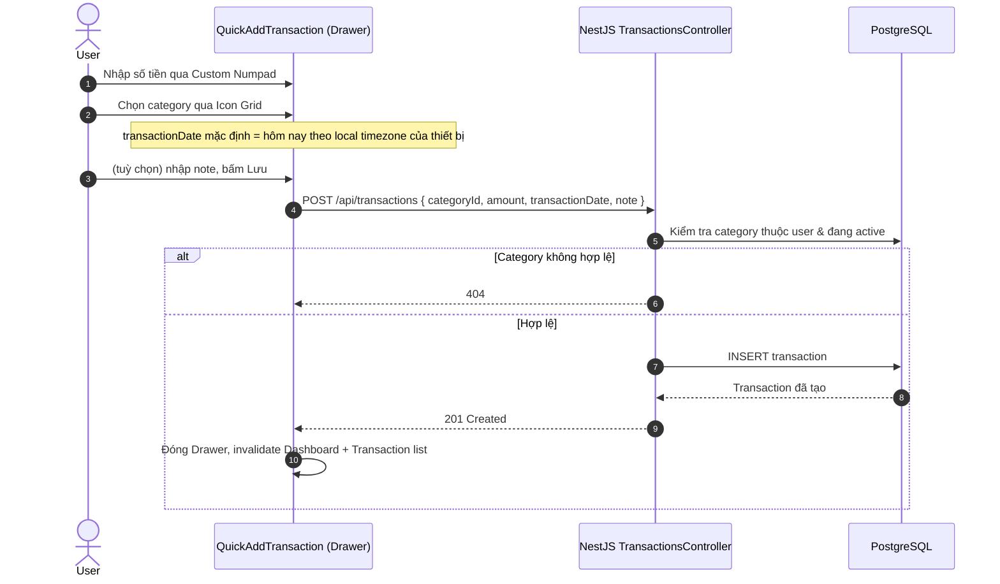
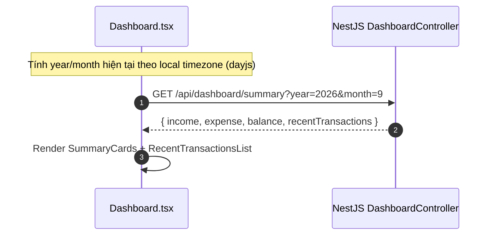

# Phase 2 — Core CRUD Plan: Categories, Transactions, Dashboard, Reports

> **Project**: MySpend — Personal Expense Tracker
> **Base**: Phase 1 (Auth + Profile) đã hoàn thành, tái sử dụng toàn bộ pattern hiện có (Nx monorepo, repository không extend `Repository<T>`, DTO + `class-validator`, `IBaseEntity`, global `JwtAuthGuard`)
> **Status**: 📝 Plan — chưa code

---

## Table of Contents
1. [Database Schema & Migrations](#1-database-schema--migrations)
2. [Shared Library Additions](#2-shared-library-additions)
3. [Backend — Categories Module](#3-backend--categories-module)
4. [Backend — Transactions Module](#4-backend--transactions-module)
5. [Backend — Dashboard Module](#5-backend--dashboard-module)
6. [Backend — Reports Module](#6-backend--reports-module)
7. [Frontend — Structure & Pages](#7-frontend--structure--pages)
8. [Flow Diagrams](#8-flow-diagrams)
9. [API Reference](#9-api-reference)
10. [Open Decisions](#10-open-decisions)

---

## 1. Database Schema & Migrations

### `categories`

```sql
CREATE TABLE "categories" (
  "id"          uuid NOT NULL DEFAULT gen_random_uuid(),
  "user_id"     uuid NOT NULL REFERENCES "profiles"("id"),
  "name"        varchar(100) NOT NULL,
  "type"        varchar(10) NOT NULL CHECK ("type" IN ('income','expense')),
  "icon"        varchar(50) NOT NULL,
  "created_at"  TIMESTAMPTZ NOT NULL DEFAULT now(),
  "updated_at"  TIMESTAMPTZ NOT NULL DEFAULT now(),
  "deleted_at"  TIMESTAMPTZ,
  "created_by"  uuid,
  "updated_by"  uuid,
  "deleted_by"  uuid,
  CONSTRAINT "PK_categories_id" PRIMARY KEY ("id")
);

-- BR-012: chặn trùng tên cùng loại khi đang active
CREATE UNIQUE INDEX "UQ_categories_active_name"
  ON "categories" ("user_id", "type", lower("name"))
  WHERE "deleted_at" IS NULL;

CREATE INDEX "IDX_categories_user" ON "categories" ("user_id") WHERE "deleted_at" IS NULL;
```

**Lưu ý FK**: khác với `profiles.id` (tham chiếu tới `auth.users` không đặt FK cứng vì khác schema), `categories.user_id` → `profiles.id` **nên** đặt FK constraint thật, vì cùng nằm trong `public` schema và TypeORM quản lý được — giữ toàn vẹn dữ liệu ở tầng DB thay vì chỉ dựa vào application code.

### `transactions`

```sql
CREATE TABLE "transactions" (
  "id"                uuid NOT NULL DEFAULT gen_random_uuid(),
  "user_id"           uuid NOT NULL REFERENCES "profiles"("id"),
  "category_id"       uuid NOT NULL REFERENCES "categories"("id") ON DELETE RESTRICT,
  "amount"            bigint NOT NULL,
  "transaction_date"  date NOT NULL,
  "note"              varchar(200),
  "created_at"        TIMESTAMPTZ NOT NULL DEFAULT now(),
  "updated_at"        TIMESTAMPTZ NOT NULL DEFAULT now(),
  "deleted_at"        TIMESTAMPTZ,
  "created_by"        uuid,
  "updated_by"        uuid,
  "deleted_by"        uuid,
  CONSTRAINT "PK_transactions_id" PRIMARY KEY ("id"),
  CONSTRAINT "CHK_transactions_amount_positive" CHECK ("amount" > 0)
);

CREATE INDEX "IDX_transactions_user_date"
  ON "transactions" ("user_id", "transaction_date" DESC)
  WHERE "deleted_at" IS NULL;

CREATE INDEX "IDX_transactions_category" ON "transactions" ("category_id");
```

**Về BR-004 (không cho ngày tương lai) và BR-014 (timezone theo thiết bị)**: cố ý **không** đặt CHECK constraint so với `CURRENT_DATE` ở DB — Postgres chạy giờ server, còn "hôm nay" phải theo local time của client. Rule này validate ở `TransactionsService`, nhận `transactionDate` do FE tính sẵn theo local timezone gửi lên (giống cách đã thống nhất ở phần Auth trước đó cho pattern "không tin server clock khi cần local time").

### Migration files (theo đúng convention đã có)
```
apps/service/src/migrations/
  20260901000000-create-categories.ts
  20260901010000-create-transactions.ts
```

### Seed danh mục mặc định (BR-006) — không phải migration, mà là code path

Vì mỗi **user** cần bộ danh mục mặc định riêng (không phải seed 1 lần toàn hệ thống), việc này nối vào flow đã có sẵn ở Phase 1:

```
AuthService.register()  (đã có)
    └─ profilesRepository.upsertFromSupabaseUser(user)
    └─ (MỚI) categoriesService.seedDefaultCategories(profile.id)
         → tạo: Ăn uống (expense), Đi lại (expense), Mua sắm (expense), Lương (income)
```

---

## 2. Shared Library Additions

`libs/src/lib/types/`

```typescript
// category.types.ts
export enum CategoryType {
  INCOME = 'income',
  EXPENSE = 'expense',
}

export interface ICategory extends IBaseEntity {
  id: string;
  userId: string;
  name: string;
  type: CategoryType;
  icon: string;
}

// transaction.types.ts
export interface ITransaction extends IBaseEntity {
  id: string;
  userId: string;
  categoryId: string;
  category?: ICategory;   // populated on read for list/history views
  amount: number;
  transactionDate: string;  // ISO date (YYYY-MM-DD)
  note?: string | null;
}

// dashboard.types.ts
export interface IDashboardSummary {
  income: number;
  expense: number;
  balance: number;
  recentTransactions: ITransaction[];
}

// report.types.ts
export interface ICategoryBreakdownItem {
  categoryId: string;
  categoryName: string;
  icon: string;
  total: number;
  percentage: number;
}
```

---

## 3. Backend — Categories Module

**Location**: `apps/service/src/categories/`

```
categories.module.ts
categories.controller.ts
categories.service.ts
repository/categories.repository.ts
dto/
  create-category.dto.ts   { name: string; type: CategoryType; icon: string }
  update-category.dto.ts   { name?: string; icon?: string }  ← KHÔNG có `type` ở đây
```

**Điểm quan trọng (FR-CAT-007 / BR-013 — khóa loại danh mục)**: `UpdateCategoryDto` **không khai báo field `type`** — tức là về mặt API, loại danh mục không thể sửa qua endpoint update một khi đã tạo, bất kể có giao dịch hay chưa. Đơn giản và an toàn hơn so với việc cho phép sửa rồi phải check "đã có giao dịch chưa" ở tầng service. Nếu sau này thực sự cần đổi loại, nên yêu cầu người dùng xoá danh mục cũ và tạo danh mục mới — nhất quán với PRD, không phá dữ liệu lịch sử.

`CategoriesService`:
```
create(userId, dto)
  → check trùng tên active cùng loại (bắt lỗi 409 nếu vi phạm UQ index)
  → insert

findAllActive(userId)
  → dùng cho Icon Grid (Quick Add) và trang Category Management

remove(userId, id)
  → soft delete (deletedAt = now(), deletedBy = userId)
  → KHÔNG check ràng buộc transaction ở đây vì FK là RESTRICT +
    soft delete không phải hard delete, nên transaction cũ vẫn tham chiếu được
    tới category đã "ẩn" — đúng BR-007
```

---

## 4. Backend — Transactions Module

**Location**: `apps/service/src/transactions/`

```
transactions.module.ts
transactions.controller.ts
transactions.service.ts
repository/transactions.repository.ts
dto/
  create-transaction.dto.ts
    { categoryId: string (uuid); amount: number (positive int); transactionDate: string (ISO date); note?: string (max 200) }
  update-transaction.dto.ts   (all optional, same shape)
  query-transactions.dto.ts
    { page?: number; limit?: number; from?: string; to?: string; categoryId?: string }
```

`TransactionsService.create(userId, dto)`:
```
1. Validate category thuộc về userId và đang active (findOne where id=categoryId, userId, deletedAt IS NULL)
   → 404 nếu không tồn tại/không active/không thuộc user này
2. Validate transactionDate <= "hôm nay" theo local date FE gửi lên (BR-004)
3. Insert transaction
```

`TransactionsService.findAll(userId, query)`:
```
→ QueryBuilder: WHERE userId = :userId AND deletedAt IS NULL
  + optional filters: categoryId, from/to (transactionDate BETWEEN)
  + JOIN categories (lấy tên/icon để hiển thị, và type để phân loại Thu/Chi)
  + ORDER BY transactionDate DESC, createdAt DESC
  + phân trang: skip/take theo page/limit (FR-TXN-009, mục 11.5 PRD)
```

Không cần endpoint `GET /transactions/recent` riêng — Dashboard chỉ gọi `GET /transactions?limit=5` để lấy "gần nhất", tránh trùng lặp logic.

---

## 5. Backend — Dashboard Module

**Location**: `apps/service/src/dashboard/`

```
GET /api/dashboard/summary?year=2026&month=9
```

**Quan trọng**: `year`/`month` là **bắt buộc** trong query, do FE tự tính theo local timezone và gửi lên — backend không tự suy ra "tháng hiện tại" từ giờ server, đúng BR-014.

```
DashboardService.getSummary(userId, year, month):
  1. Tính khoảng ngày [firstDayOfMonth, lastDayOfMonth] từ year/month
  2. Một query aggregate (QueryBuilder):
       SELECT
         SUM(CASE WHEN c.type='income'  THEN t.amount ELSE 0 END) AS income,
         SUM(CASE WHEN c.type='expense' THEN t.amount ELSE 0 END) AS expense
       FROM transactions t JOIN categories c ON c.id = t.category_id
       WHERE t.user_id = :userId AND t.deleted_at IS NULL
         AND t.transaction_date BETWEEN :from AND :to
  3. balance = income - expense  (BR-008)
  4. recentTransactions = transactionsService.findAll(userId, { limit: 5 })
  5. Trả về IDashboardSummary
```

---

## 6. Backend — Reports Module

**Location**: `apps/service/src/reports/`

```
GET /api/reports/category-breakdown?from=2026-09-01&to=2026-09-30
```

```
ReportsService.getCategoryBreakdown(userId, from, to):
  SELECT c.id, c.name, c.icon, SUM(t.amount) AS total
  FROM transactions t JOIN categories c ON c.id = t.category_id
  WHERE t.user_id = :userId AND t.deleted_at IS NULL
    AND c.type = 'expense'          -- FR-REP-005: loại trừ Thu nhập
    AND t.transaction_date BETWEEN :from AND :to
  GROUP BY c.id, c.name, c.icon
  ORDER BY total DESC               -- FR-REP-003: xếp hạng giảm dần

  → percentage = total / SUM(total của toàn bộ nhóm) * 100 (tính ở service, không ở DB)
```

`from`/`to` do FE tính theo bộ lọc Tuần/Tháng (FR-REP-002) — cùng nguyên tắc timezone như Dashboard.

---

## 7. Frontend — Structure & Pages

```
apps/client/src/
  pages/
    Dashboard.tsx            (đã scaffold — nay build đầy đủ)
    Categories.tsx            (mới)
    TransactionHistory.tsx    (mới — màn hình 11.5 PRD)
    Reports.tsx                (mới)
  components/
    transactions/
      QuickAddTransaction.tsx  (Drawer/Modal chứa Custom Numpad + Icon Grid — FR-UX-001/002)
      TransactionListItem.tsx
    categories/
      CategoryForm.tsx
      CategoryIconPicker.tsx
    dashboard/
      SummaryCards.tsx
      RecentTransactionsList.tsx
    reports/
      CategoryDonutChart.tsx   (dùng `recharts` — chưa có trong stack, cần thêm dependency)
  services/
    category.service.ts
    transaction.service.ts
    dashboard.service.ts
    report.service.ts
```

`AppRoutes` (mở rộng enum đã có ở `consts/routes.ts`):
```typescript
export enum AppRoutes {
  HOME              = '/',
  LOGIN             = '/login',
  REGISTER          = '/register',
  PROFILE           = '/profile',
  CATEGORIES        = '/categories',      // MỚI
  TRANSACTIONS      = '/transactions',    // MỚI
  REPORTS           = '/reports',         // MỚI
}
```
Tất cả route mới đều nằm trong `<ProtectedRoute>` đã có sẵn từ Phase 1, không cần thêm guard mới.

---

## 8. Flow Diagrams

### 8.1 Quick Add Transaction



### 8.2 Dashboard Load



### 8.3 Delete Category (đã có giao dịch tham chiếu)

```mermaid
sequenceDiagram
    autonumber
    actor User
    participant FE as Categories.tsx
    participant API as NestJS CategoriesController
    participant DB as PostgreSQL

    User->>FE: Bấm Xoá trên một category
    FE->>API: DELETE /api/categories/:id
    API->>DB: UPDATE categories SET deleted_at = now() WHERE id = :id AND user_id = :userId
    Note over API,DB: FK từ transactions là RESTRICT chỉ chặn HARD delete;<br/>soft delete không đụng tới transactions cũ (BR-007)
    DB-->>API: OK
    API-->>FE: 200 OK
    FE->>FE: Category biến mất khỏi danh sách active & Icon Grid,<br/>nhưng lịch sử giao dịch cũ vẫn hiển thị bình thường
```

---

## 9. API Reference

### Categories

| Method | Path | Auth | Body | Response |
|---|---|---|---|---|
| `POST` | `/categories` | Bearer JWT | `CreateCategoryDto` | `ICategory` |
| `GET` | `/categories` | Bearer JWT | — | `ICategory[]` (active only) |
| `PATCH` | `/categories/:id` | Bearer JWT | `UpdateCategoryDto` (no `type`) | `ICategory` |
| `DELETE` | `/categories/:id` | Bearer JWT | — | `{ success: true }` |

### Transactions

| Method | Path | Auth | Body/Query | Response |
|---|---|---|---|---|
| `POST` | `/transactions` | Bearer JWT | `CreateTransactionDto` | `ITransaction` |
| `GET` | `/transactions` | Bearer JWT | `page, limit, from, to, categoryId` | `{ data: ITransaction[], total, page, limit }` |
| `PATCH` | `/transactions/:id` | Bearer JWT | `UpdateTransactionDto` | `ITransaction` |
| `DELETE` | `/transactions/:id` | Bearer JWT | — | `{ success: true }` |

### Dashboard & Reports

| Method | Path | Auth | Query | Response |
|---|---|---|---|---|
| `GET` | `/dashboard/summary` | Bearer JWT | `year, month` | `IDashboardSummary` |
| `GET` | `/reports/category-breakdown` | Bearer JWT | `from, to` | `ICategoryBreakdownItem[]` |

---

## 10. Open Decisions

- **Denormalize `category.type` lên `transaction`?** Hiện tại mọi query báo cáo/dashboard phải JOIN `categories` để biết Thu/Chi (vì type không lưu trực tiếp trên transaction, theo BR-002). Với quy mô dữ liệu cá nhân thì không vấn đề gì; chỉ nên cân nhắc denormalize nếu sau này thấy JOIN chậm — không cần làm trước (YAGNI).
- **Thêm TanStack React Query ở FE?** Từ Phase 2 trở đi, số lượng nguồn dữ liệu phụ thuộc lẫn nhau tăng lên (thêm 1 giao dịch phải làm mới cả Dashboard, Transaction List, lẫn Reports). Hiện Phase 1 mới chỉ dùng `useEffect` gọi service thủ công. Nếu tiếp tục thủ công, bạn sẽ phải tự viết nhiều chỗ "gọi lại API sau khi mutate" rải rác. Đây là điểm đáng cân nhắc thêm dependency mới — mình gợi ý nhưng để bạn quyết định vì nó ảnh hưởng cấu trúc code khá nhiều nơi.
- **Package tên `@hr-systems/libs`**: nên đổi thành `@myspend/libs` trước khi thêm nhiều type mới vào, tránh sửa lại import ở quy mô lớn hơn sau này.
