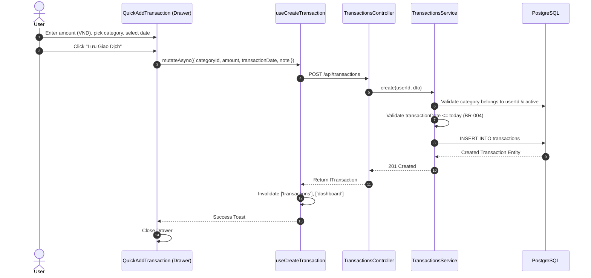
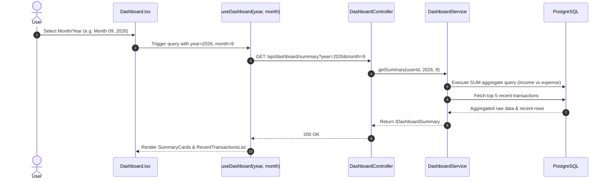

# Phase 2 — Core CRUD: Categories, Transactions, Dashboard & Reports Flow Summary

> **Project**: MySpend — Personal Expense Tracker  
> **Stack**: Nx 21 Monorepo | NestJS 11 (service) | React 19 + Vite (client) | TanStack React Query v5 | Recharts | PostgreSQL + TypeORM 0.3.x  
> **Status**: ✅ Complete — Tested & Working  

---

## Table of Contents

1. [Architecture Overview](#1-architecture-overview)
2. [Database Schema & SQL DDL](#2-database-schema--sql-ddl)
3. [Shared Library (`@myspend/libs`)](#3-shared-library-myspendlibs)
4. [Backend — Categories Module](#4-backend--categories-module)
5. [Backend — Transactions Module](#5-backend--transactions-module)
6. [Backend — Unified Reports Module](#6-backend--unified-reports-module)
7. [Frontend — Infrastructure & State Management](#7-frontend--infrastructure--state-management)
8. [Frontend — Pages & Component Architecture](#8-frontend--pages--component-architecture)
9. [End-to-End Flow Diagrams](#9-end-to-end-flow-diagrams)
10. [API Reference](#10-api-reference)
11. [Business Rules Enforcement Checklist](#11-business-rules-enforcement-checklist)

---

## 1. Architecture Overview

Phase 2 builds upon the authentication and profile foundation established in Phase 1, introducing the core financial domain models: **Categories**, **Transactions**, **Dashboard Summaries**, and **Financial Reports**.

```
┌───────────────────────────────────────────────────────────────────────────────────┐
│                                   Nx Monorepo                                     │
│                                                                                   │
│   ┌────────────────────────────────┐        ┌─────────────────────────────────┐   │
│   │  apps/client                   │        │  apps/service                   │   │
│   │  React 19 + Vite + Antd v5     │◄──────►│  NestJS 11                      │   │
│   │  TanStack React Query v5       │  HTTP  │  TypeORM 0.3.x (QueryBuilder)  │   │
│   │  Recharts                      │        │  Global JwtAuthGuard            │   │
│   │  :4200                         │        │  :3000/api                      │   │
│   └────────────────────────────────┘        └────────────────┬────────────────┘   │
│                                                              │                    │
│   ┌────────────────────────────────┐                         │                    │
│   │  libs/src/lib/                 │        ┌────────────▼────────────────┐   │
│   │  @myspend/libs                 │        │  PostgreSQL                 │   │
│   │  CategoryTypeEnum, ICategory,  │        │  (profiles, categories,     │   │
│   │  ITransaction, IDashboard...   │        │   transactions tables)      │   │
│   └────────────────────────────────┘        └─────────────────────────────┘   │
└───────────────────────────────────────────────────────────────────────────────────┘
```

### Key Technical Principles:
1. **Repository Pattern without Inheritance**: Repositories inject `@InjectRepository(Entity)` and do **not** extend `Repository<T>` directly (strictly obeying AGENTS.md).
2. **Serverless Local Timezone Handling**: Date filters and transaction dates are sent from the client as `YYYY-MM-DD` strings based on the user's device clock rather than relying on server system time.
3. **Reactive Frontend Caching**: TanStack Query v5 manages all server state. Creating, updating, or deleting a transaction triggers targeted query invalidation across `['transactions']`, `['dashboard']`, and `['categories']`.
4. **Non-destructive Soft Deletes**: Soft-deleted categories preserve all existing transactions referencing them (BR-007).

---

## 2. Database Schema & SQL DDL

Database creation file: [`database/phase2_schema.sql`](file:///Users/duyanh/Personal/Products/PersonalExpenseTrackerWebApp/MySpend/database/phase2_schema.sql)

### 2.1 `categories` Table

```sql
CREATE TABLE "categories" (
  "id"          uuid         NOT NULL DEFAULT gen_random_uuid(),
  "user_id"     uuid         NOT NULL REFERENCES "profiles"("id"),
  "name"        varchar(100) NOT NULL,
  "type"        varchar(10)  NOT NULL CHECK ("type" IN ('income', 'expense')),
  "icon"        varchar(50)  NOT NULL,
  "created_at"  TIMESTAMPTZ  NOT NULL DEFAULT now(),
  "updated_at"  TIMESTAMPTZ  NOT NULL DEFAULT now(),
  "deleted_at"  TIMESTAMPTZ,
  "created_by"  uuid,
  "updated_by"  uuid,
  "deleted_by"  uuid,
  CONSTRAINT "PK_categories_id" PRIMARY KEY ("id")
);

-- BR-012: Prevent duplicate active category names for the same user and type
CREATE UNIQUE INDEX "UQ_categories_active_name"
  ON "categories" ("user_id", "type", lower("name"))
  WHERE "deleted_at" IS NULL;

CREATE INDEX "IDX_categories_user"
  ON "categories" ("user_id")
  WHERE "deleted_at" IS NULL;
```

### 2.2 `transactions` Table

```sql
CREATE TABLE "transactions" (
  "id"                uuid         NOT NULL DEFAULT gen_random_uuid(),
  "user_id"           uuid         NOT NULL REFERENCES "profiles"("id"),
  "category_id"       uuid         NOT NULL REFERENCES "categories"("id") ON DELETE RESTRICT,
  "amount"            bigint       NOT NULL,
  "transaction_date"  date         NOT NULL,
  "note"              varchar(200),
  "created_at"        TIMESTAMPTZ  NOT NULL DEFAULT now(),
  "updated_at"        TIMESTAMPTZ  NOT NULL DEFAULT now(),
  "deleted_at"        TIMESTAMPTZ,
  "created_by"        uuid,
  "updated_by"        uuid,
  "deleted_by"        uuid,
  CONSTRAINT "PK_transactions_id"              PRIMARY KEY ("id"),
  CONSTRAINT "CHK_transactions_amount_positive" CHECK ("amount" > 0)
);

CREATE INDEX "IDX_transactions_user_date"
  ON "transactions" ("user_id", "transaction_date" DESC)
  WHERE "deleted_at" IS NULL;

CREATE INDEX "IDX_transactions_category"
  ON "transactions" ("category_id");
```

---

## 3. Shared Library (`@myspend/libs`)

Located in `libs/src/lib/`, re-exported via `libs/src/lib/libs.ts`.

### 3.1 `CategoryTypeEnum` (`enums/category-type.enum.ts`)

```typescript
export enum CategoryTypeEnum {
  INCOME = 'income',
  EXPENSE = 'expense',
}
```

### 3.2 `ICategory` (`types/category.types.ts`)

```typescript
export interface ICategory extends IBaseEntity {
  id: string;
  userId: string;
  name: string;
  type: CategoryTypeEnum;
  icon: string;
}
```

### 3.3 `ITransaction` (`types/transaction.types.ts`)

```typescript
export interface ITransaction extends IBaseEntity {
  id: string;
  userId: string;
  categoryId: string;
  category?: ICategory;
  amount: number;
  transactionDate: string; // ISO date format YYYY-MM-DD
  note?: string | null;
}
```

### 3.4 `IDashboardSummary` & `ICategoryBreakdownItem`

```typescript
export interface IDashboardSummary {
  income: number;
  expense: number;
  balance: number;
  recentTransactions: ITransaction[];
}

export interface ICategoryBreakdownItem {
  categoryId: string;
  categoryName: string;
  icon: string;
  total: number;
  percentage: number;
}
```

---

## 4. Backend — Categories Module

**Location**: `apps/service/src/categories/`

### 4.1 Immutability of Category Type (BR-013)
The `UpdateCategoryDto` explicitly excludes the `type` property. Once a category is created as `expense` or `income`, its type cannot be modified via update endpoints.

```typescript
export class UpdateCategoryDto {
  @IsOptional() @IsString() @MaxLength(100) name?: string;
  @IsOptional() @IsString() @MaxLength(50) icon?: string;
}
```

### 4.2 Automated Category Seeding on Registration (BR-006)
When a new user registers via `AuthService.register()`, `CategoriesService.seedDefaultCategories(userId)` is automatically invoked to provision 4 default categories:

| Category Name | Type | Icon Slug |
|---|---|---|
| Ăn uống | `expense` | `utensils` |
| Đi lại | `expense` | `car` |
| Mua sắm | `expense` | `shopping-bag` |
| Lương | `income` | `banknote` |

### 4.3 Unique Constraint Handling (BR-012)
`CategoriesService` catches Postgres error code `23505` (unique index violation) and returns a user-friendly `409 ConflictException`:
```
"A category named 'Ăn uống' already exists for this type."
```

---

## 5. Backend — Transactions Module

**Location**: `apps/service/src/transactions/`

### 5.1 Business Rules & Guards
1. **Category Ownership Validation**: Before inserting or updating a transaction, `TransactionsService` checks that `categoryId` exists, belongs to `userId`, and is not soft-deleted (`deletedAt IS NULL`).
2. **Future Date Prevention (BR-004)**: `transactionDate` is validated to ensure it does not exceed the current date string (`YYYY-MM-DD`).

### 5.2 Bigint Transformer for Amount
In `TransactionEntity`, amount is stored as `bigint` in PostgreSQL to support high integer values (VND without cents) and transformed to a JavaScript `number` on read:

```typescript
@Column({
  type: 'bigint',
  name: 'amount',
  transformer: {
    from: (v: string) => parseInt(v, 10),
    to: (v: number) => v,
  },
})
amount!: number;
```

### 5.3 Paginated Query Execution (`TransactionsRepository`)

```typescript
async findAll(userId: string, query: QueryTransactionsDto): Promise<ITransactionPage> {
  const page = query.page ?? 1;
  const limit = query.limit ?? 20;
  const skip = (page - 1) * limit;

  const qb = this.repository
    .createQueryBuilder('t')
    .leftJoinAndSelect('t.category', 'c')
    .where('t.user_id = :userId', { userId })
    .andWhere('t.deleted_at IS NULL');

  if (query.categoryId) {
    qb.andWhere('t.category_id = :categoryId', { categoryId: query.categoryId });
  }
  if (query.from) {
    qb.andWhere('t.transaction_date >= :from', { from: query.from });
  }
  if (query.to) {
    qb.andWhere('t.transaction_date <= :to', { to: query.to });
  }

  qb.orderBy('t.transaction_date', 'DESC').addOrderBy('t.created_at', 'DESC');
  qb.skip(skip).take(limit);

  const [data, total] = await qb.getManyAndCount();
  return { data, total, page, limit };
}
```

---

## 6. Backend — Dashboard Module

**Location**: `apps/service/src/dashboard/`

`DashboardService.getSummary(userId, year, month)` calculates monthly metrics:
- Determines month range `[firstDay, lastDay]` for the given `year` and `month`.
- Executes single SQL aggregate query joining `categories` to sum income vs expense:
  ```sql
  SELECT
    SUM(CASE WHEN c.type = 'income'  THEN t.amount ELSE 0 END) AS income,
    SUM(CASE WHEN c.type = 'expense' THEN t.amount ELSE 0 END) AS expense
  FROM transactions t JOIN categories c ON c.id = t.category_id
  WHERE t.user_id = :userId AND t.deleted_at IS NULL
    AND t.transaction_date BETWEEN :from AND :to
  ```
- Calculates `balance = income - expense` (BR-008).
- Fetches the 5 most recent transactions via `TransactionsService.findAll(userId, { limit: 5 })`.

---

## 7. Backend — Reports Module

**Location**: `apps/service/src/reports/`

`ReportsService.getCategoryBreakdown(userId, from, to)` computes category breakdown for expense items:
- Queries sum of expenses grouped by category (`c.id`, `c.name`, `c.icon`).
- Sorts categories in descending order by total expense.
- Computes percentage for each category in the service layer:  
  `percentage = Math.round((total / grandTotal) * 10000) / 100`.

---

## 8. Frontend — Infrastructure & State Management

### 8.1 TanStack Query Setup (`lib/query-client.ts`)
- Configured with `staleTime: 30_000` (30s) and `refetchOnWindowFocus: false`.
- Provided at top level in `main.tsx` using `<QueryClientProvider client={queryClient}>`.

### 8.2 Invalidation Topology
Mutating data automatically refreshes dependent queries:

```
useCreateTransaction / useUpdateTransaction / useDeleteTransaction
    ├── Invalidates ['transactions']  → Updates TransactionHistory & RecentList
    ├── Invalidates ['dashboard']     → Updates Summary Cards & Month View
    └── Invalidates ['categories']    → Updates active category usage
```

### 8.3 Custom Hooks Summary

| Hook | Query Key | Description |
|---|---|---|
| `useCategories()` | `['categories']` | Fetches active categories |
| `useCreateCategory()` | mutation | Creates category + invalidates `['categories']` |
| `useUpdateCategory()` | mutation | Updates category + invalidates `['categories']` |
| `useDeleteCategory()` | mutation | Soft-deletes category + invalidates `['categories']` |
| `useTransactions(query)` | `['transactions', query]` | Paginated transaction list with filters |
| `useCreateTransaction()` | mutation | Creates transaction + invalidates transactions & dashboard |
| `useUpdateTransaction()` | mutation | Updates transaction + invalidates transactions & dashboard |
| `useDeleteTransaction()` | mutation | Deletes transaction + invalidates transactions, dashboard, categories |
| `useDashboard(year, month)` | `['dashboard', year, month]` | Monthly summary data |
| `useCategoryBreakdown(from, to)` | `['reports', 'breakdown', from, to]` | Expense breakdown for donut chart |

---

## 9. Frontend — Pages & Component Architecture

```
apps/client/src/
├── pages/
│   ├── Dashboard.tsx            # Summary Cards + 5 Recent Transactions + Month Selector
│   ├── Categories.tsx           # Category Grid (Expense/Income) + Form Modal
│   ├── TransactionHistory.tsx   # Paginated List + Category Filter + Date Range Picker
│   └── Reports.tsx              # Recharts Category Donut Chart + Percentage Breakdown
│
├── components/
│   ├── dashboard/
│   │   ├── Header.tsx           # Top Bar + Navigation Links + User Profile Menu
│   │   ├── SummaryCards.tsx     # Income, Expense, Balance in VND format
│   │   ├── RecentTransactionsList.tsx
│   │   └── MobileBottomNav.tsx  # Mobile bottom bar with active route matching
│   │
│   ├── categories/
│   │   ├── CategoryForm.tsx     # Antd Modal for Category Create/Update
│   │   └── CategoryIconPicker.tsx # Lucide icon grid picker & rendering helper
│   │
│   ├── transactions/
│   │   ├── QuickAddTransaction.tsx # Antd Drawer with amount input & category grid
│   │   └── TransactionListItem.tsx # Single transaction row with icon & delete popconfirm
│   │
│   └── reports/
│       └── CategoryDonutChart.tsx  # Recharts PieChart with tooltip & percentage list
```

### 9.1 Key UI Details & Fixes
- **Date Escaping**: Fixed Day.js format string escaping bug by wrapping literal text in square brackets: `format="[Tháng] MM, YYYY"`.
- **Dynamic Header Active Tabs**: Header navigation links use `useLocation().pathname` from React Router to ensure active tab styling updates dynamically on client-side navigation.
- **Mobile Bottom Navigation**: Integrated `MobileBottomNav` across all main routes (`/`, `/categories`, `/transactions`, `/reports`) with central Quick Add FAB button.

---

## 10. End-to-End Flow Diagrams

### 10.1 Quick Add Transaction Flow



### 10.2 Monthly Dashboard Load Flow



---

## 11. API Reference

### Categories (`/api/categories`)

| Method | Endpoint | Auth | Body / Query | Description |
|---|---|---|---|---|
| `POST` | `/api/categories` | Bearer JWT | `CreateCategoryDto` | Create a new category |
| `GET` | `/api/categories` | Bearer JWT | — | List all active categories for user |
| `PATCH` | `/api/categories/:id` | Bearer JWT | `UpdateCategoryDto` (no type) | Update category name/icon |
| `DELETE` | `/api/categories/:id` | Bearer JWT | — | Soft-delete category |

### Transactions (`/api/transactions`)

| Method | Endpoint | Auth | Query / Body | Description |
|---|---|---|---|---|
| `POST` | `/api/transactions` | Bearer JWT | `CreateTransactionDto` | Create transaction |
| `GET` | `/api/transactions` | Bearer JWT | `page, limit, from, to, categoryId` | List paginated transactions |
| `PATCH` | `/api/transactions/:id` | Bearer JWT | `UpdateTransactionDto` | Update transaction |
| `DELETE` | `/api/transactions/:id` | Bearer JWT | — | Soft-delete transaction |

### Dashboard & Reports (`/api/dashboard`, `/api/reports`)

| Method | Endpoint | Auth | Query | Description |
|---|---|---|---|---|
| `GET` | `/api/dashboard/summary` | Bearer JWT | `year, month` | Monthly financial summary |
| `GET` | `/api/reports/category-breakdown` | Bearer JWT | `from, to` | Category breakdown for donut chart |

---

## 12. Business Rules Enforcement Checklist

| Business Rule | Status | Implementation Details |
|---|---|---|
| **BR-002** (Category Type Income/Expense) | ✅ Enforced | Category enum values `income` / `expense` strictly defined in `@myspend/libs`. |
| **BR-004** (No Future Transaction Dates) | ✅ Enforced | Checked in `TransactionsService.create` & `update` against local date string. |
| **BR-006** (Default Categories on Register) | ✅ Enforced | `CategoriesService.seedDefaultCategories()` auto-called in `AuthService.register()`. |
| **BR-007** (Soft-delete Category Retention) | ✅ Enforced | `ON DELETE RESTRICT` on FK + `deleted_at` column ensures existing transactions retain link to soft-deleted categories. |
| **BR-008** (Balance Calculation) | ✅ Enforced | `balance = income - expense` computed accurately in `DashboardService`. |
| **BR-012** (Unique Active Category Name) | ✅ Enforced | PostgreSQL Partial Unique Index `UQ_categories_active_name` + NestJS `ConflictException`. |
| **BR-013** (Category Type Immutability) | ✅ Enforced | `type` property excluded from `UpdateCategoryDto`. |
| **BR-014** (Device Timezone Independence) | ✅ Enforced | Client sends device date `YYYY-MM-DD`; backend does not assume server clock. |

---

## File Structure Map

```
MySpend/
├── database/
│   └── phase2_schema.sql                # SQL DDL for categories & transactions tables
│
├── Phase2_Core_CRUD_Flow_Summary.md     # This comprehensive report
│
├── libs/src/lib/
│   ├── libs.ts                          # Shared barrel re-exports
│   ├── enums/category-type.enum.ts      # CategoryTypeEnum
│   └── types/
│       ├── category.types.ts            # ICategory
│       ├── transaction.types.ts         # ITransaction
│       ├── dashboard.types.ts           # IDashboardSummary
│       └── report.types.ts              # ICategoryBreakdownItem
│
├── apps/service/src/
│   ├── app.module.ts                    # Module registration
│   ├── entities/
│   │   ├── category/category.entity.ts
│   │   └── transaction/transaction.entity.ts
│   ├── categories/
│   │   ├── categories.module.ts
│   │   ├── categories.controller.ts
│   │   ├── categories.service.ts
│   │   ├── repository/categories.repository.ts
│   │   └── dto/
│   │       ├── create-category.dto.ts
│   │       └── update-category.dto.ts
│   ├── transactions/
│   │   ├── transactions.module.ts
│   │   ├── transactions.controller.ts
│   │   ├── transactions.service.ts
│   │   ├── repository/transactions.repository.ts
│   │   └── dto/
│   │       ├── create-transaction.dto.ts
│   │       ├── update-transaction.dto.ts
│   │       └── query-transactions.dto.ts
│   ├── dashboard/
│   │   ├── dashboard.module.ts
│   │   ├── dashboard.controller.ts
│   │   └── dashboard.service.ts
│   └── reports/
│       ├── reports.module.ts
│       ├── reports.controller.ts
│       └── reports.service.ts
│
└── apps/client/src/
    ├── main.tsx                         # QueryClientProvider setup
    ├── App.tsx                          # Protected routes configuration
    ├── consts/routes.ts                 # AppRoutes enum
    ├── lib/query-client.ts              # QueryClient singleton
    ├── services/
    │   ├── category.service.ts
    │   ├── transaction.service.ts
    │   ├── dashboard.service.ts
    │   └── report.service.ts
    ├── hooks/
    │   ├── useCategories.ts
    │   ├── useTransactions.ts
    │   ├── useDashboard.ts
    │   └── useReports.ts
    ├── components/
    │   ├── dashboard/
    │   │   ├── Header.tsx
    │   │   ├── SummaryCards.tsx
    │   │   ├── RecentTransactionsList.tsx
    │   │   └── MobileBottomNav.tsx
    │   ├── categories/
    │   │   ├── CategoryForm.tsx
    │   │   └── CategoryIconPicker.tsx
    │   ├── transactions/
    │   │   ├── QuickAddTransaction.tsx
    │   │   └── TransactionListItem.tsx
    │   └── reports/
    │       └── CategoryDonutChart.tsx
    └── pages/
        ├── Dashboard.tsx
        ├── Categories.tsx
        ├── TransactionHistory.tsx
        └── Reports.tsx
```
